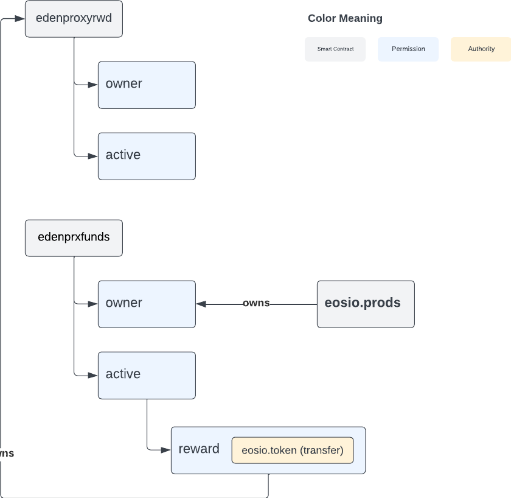
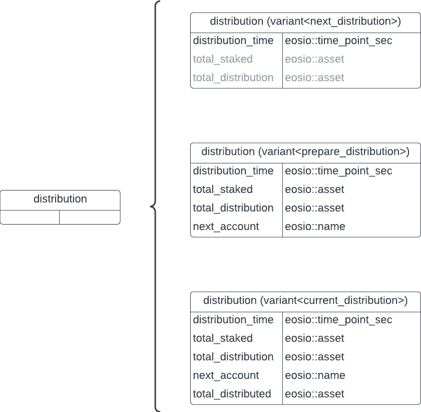
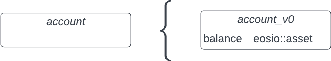
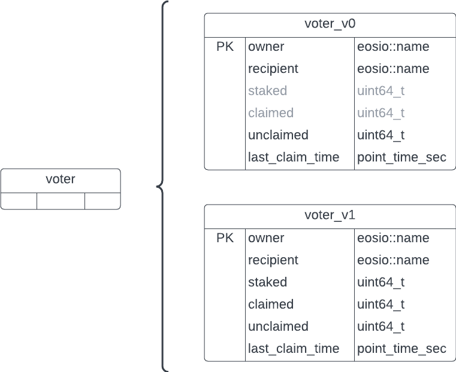
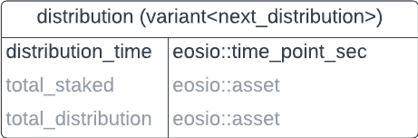
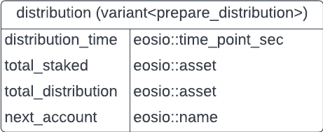
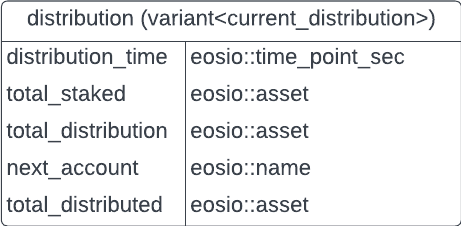

# Proxy Reward

The proxy reward aims to distribute funds to all the accounts that have delegated their vote to the edensmartprx.

## Communication

This `edenproxyrwd` contract will communicate with two contracts to get the inflation and the transferring of the funds.

### eosio

Read the inflation of the network.

### edenprxfunds

Holds the `EOS` reward transferred by inflation from the network.
It requires to create a new permission `reward` with the signature of `edenproxyrwd` configured with the authority of transferring tokens using the `eosio.token` contract to send the funds. This new `reward` permission will be a children's permission of active. The `eosio.prods` account will be the owner of the edenprxfunds' owner permission. The following diagram illustrates the hierarchy of the permissions.



## Actions

Here is a list of actions and tables that will compose the Eden Reward Smart Contract.

### Open Actions

#### distribute (daily)

Update the staked tokens of each active account and the corresponding reward if it applies. It receives max steps to process certain rows safely. The Smart Contract state is updated during this process with next_distribution, prepare_distribution and current_distribution. We will explain it shortly.

### User Actions

#### signup

To receive rewards, the accounts that have delegated their vote to the Eden Smart Proxy can sign up to get daily funds.

#### resign

It is possible for users to resign themselves if there is no distribution in progress and no unclaimed rewards pending.

#### changercpt

Accounts can have a different recipient if they wish and can be changed at any moment if and only if the account is active and hasn't been banned by admins.

#### claim

Accounts can claim their rewards if they are active (delegating the vote to the proxy reward), and if they have not been blocked by admins.

### Admin Actions

#### init

Set the next distribution in 24 hours with a balance of 0.

#### receipt

This is only for trace transparency. The Smart Contract will execute this action every time a reward is distributed, so it mustn't be called manually.

#### changercpt with flag = true

Admin can block an account with the recipient field empty.

## Tables

### distribution

Scoped by contract name, it holds information about the distribution state, which are: waiting for the next distribution, preparing the distribution and distributing.



### account

Scoped by master, it holds information of the balance in the edenprxfunds to be rewarded.



### voter

Scoped by contract name, it holds information about the accounts that are delegating their vote to the edenproxyrwd and the amount of unclaimed rewards.



## States

The Smart Contract has three states: waiting for a next distribution, preparing a coming distribution and distributing. According to what state the contract is, it blocks some functionalities like, being able to resign and calling the distribute action.

### First State: Next Distribution

Once the contract is initialized, the contract will set a next distribution, which is the first state and the one that most of the time the contract will be. Once the distribution is reached, the contract will allow to call the `distribute` action. When it is called, the state will change to prepare a coming distribution.



### Second State: Prepare Distribution

In this state, the distribute action is available again and since a distribution has started, the contract will block the resign option to avoid spoiling the distribution calculation. The contract starts reviewing the voters/stakers that are active or inactive. If an account is marked as inactive (stop delegating its vote the edensmartprx), then that account will be moved to the `inactive` scope of the voter table and will not receive any reward in the distribution. The account will need to signup manually again to be considered. Once all accounts have been updated with their corresponding states and staked amount, the contract will pass to the distributing state.



### Third State: Distributing

This is the final state, the contract will give the rewards to every account based on the formula. Once the distribution finishes, the contract will set a next distribution (first state) which is the current distribution date + 1 day.



## Rewards

The distribution reward will be available every 24 hours. The formula to calculate the rewards is:

```cpp
reward = (amount staked by the account / total amount staked) * Daily inflation directed to proxy from the network.
```

## Dependencies

The `distribute` action will need to be called every 24 hours (after the next distribution time has passed or equal to the blockchain current time), for this a cron-job solution is required to give the daily rewards and prevent the distributions get messed up.

## Considerations

- An account will be marked as inactive if they have stopped delegating their vote to the `edensmartprx`, if that happens, the account will need to delegate their vote back again and sign up to be considered for coming distributions.
- If there is no account to reward, the distribution will be passed to the next distribution day.
- Inactive accounts can't claim rewards. To be able to claim a reward, the accounts need to delegate its vote to the `edensmartprx` again and sign up again.
- If an account is banned, that account should get in contact with admins to remove the ban.
